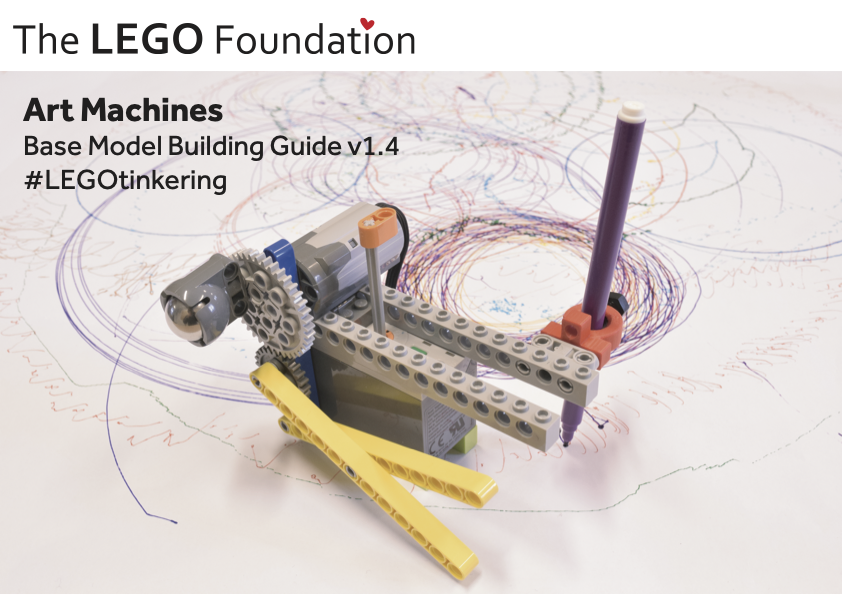

## Open-Ended Building Instructions

LEGO Art Machines is a playful learning activity developed by the Tinkering Studio and the LEGO Idea Studio. Used in workshops and as a drop-in tinkering activity, Art Machines invites people to build a machine that draws a pattern.

The [Tinkering Studio's project page](https://www.exploratorium.edu/tinkering/projects/LEGO-art-machines) and the activity [Instructable](https://www.instructables.com/Tinkering-With-LEGO-Art-Machines/) document the Art Machines activity really well. Check out those links to find out how to run the activity yourself.

LEGO Art Machines is a _tinkering_ activity. That means it's open-ended. It's not a game that can be won; it is a playful context to explore. It's closer to a sandbox than a Rubik's cube.

A challenge to running this activity is the fragility of the connection points between LEGO pieces under strain from the machine's movement. This issue was solved by giving users a "base model" rather than just the raw pieces for them to start from scratch. The base models affix the motor to the battery pack and give the machine one simple movement that each user can build on to.

In 2018 I made a building instruction booklet to offload the work of creating base models before a workshop onto the participants, who might also feel a greater sense of ownership of their machine having built it from the raw pieces. This project was an effort to combine the intuitive (and near-ubiquitous) LEGO building instructions with the open-ended pedagogical approach from LEGO Art Machines.

The book starts users off without any choice, just like a standard building instruction. After a few initial steps are completed and the motor is affixed to the battery, the booklet gives users three choices of new directions to go. That page includes photographs that show what type of pattern each base model will create.

The user picks a path, and the building instructions continue. When the basemodel is complete, the instructions show them how to tip the machine over so the pen meets the paper, and press the power button so it starts to move. The photographs show a few messy examples of what their art machine might look like when they've continued iterating - going beyond the instructions.

 <iframe src="https://www.youtube.com/watch?v=BxtkVH4FqGQ" height="200" width="300" title="Supercut of LEGO Art Machines"></iframe> 

*Supercut of LEGO Art Machines*



Art Machines is on the "sandbox" side of the spectrum



One possibility becomes three possibilities



Builders are instructed to turn the machine on and tip it over so that it begins to draw. The photographs show what their machine might look look when they've continued building on their own.

<a href="/documents/AMBM-Guide-Medium.pdf">Base Model Building Guide.pdf</a>